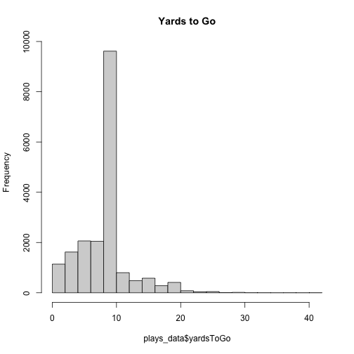
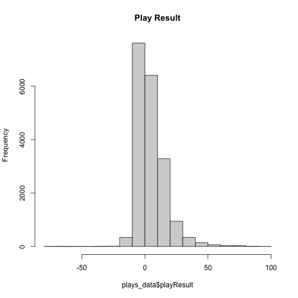
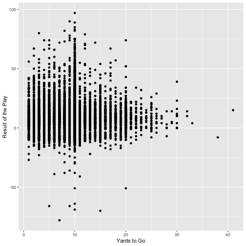
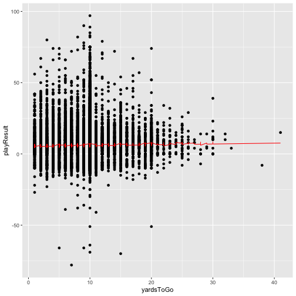

 


library(knitr)

knit2html("my_file.Rmd")

The play result is the outcome variable, yards to go is explanatory


Introduction


Data and Research Design


```r
library(tidyverse)
plays_data <- read.csv("plays.csv")

plays_data <- plays_data |>
  mutate(plays_data$yardsToGo)
plays_data

plot <- plays_data |>
  filter(yardsToGo == "Remaining Yards") |>
  ggplot(mapping = aes(x = plays_data$yardsToGo)) + geom_histogram()
hist(x = plays_data$yardsToGo, main = "Yards to Go")
```



The above graph is an example of the average number of yards to gain when a team is facing a third down play, which means they have one opportunity to convert or they will likely have to punt, or in other words give the ball away. 


```r
plays_data <- plays_data |>
  mutate(plays_data$playResult)
plays_data

plot <- plays_data |>
  filter(yardsToGo == "Remaining Yards") |>
  ggplot(mapping = aes(x = plays_data$playResult)) + geom_histogram()
hist(x = plays_data$playResult, main = "Play Result")
```


histogram of distribution of outcome variable

Subsequently, this histogram shows the average result of these plays, where you can see how the teams usually fare when they are faced with the tall task of trying to convert a third down play. 


```r
library(ggplot2)


ggplot(plays_data, aes(x = yardsToGo, y = playResult)) +
  geom_point() +
  xlab("Yards to Go") +
  ylab("Result of the Play")
```


Bivariate plot with explanatory variable on x-axis and outcome variable on y-axis

```r
library(broom)

model <- lm(plays_data$playResult ~ plays_data$yardsToGo, plays_data = plays_data)
```

```
## Warning: In lm.fit(x, y, offset = offset, singular.ok = singular.ok, ...) :
##  extra argument 'plays_data' will be disregarded
```

```r
results <- tidy(model)

results
```
regression results for multivariate model

```r
model_formula <- plays_data$playResult ~ plays_data$yardsToGo + plays_data$down 

fit <- lm(model_formula, plays_data)


predictions <- predict(fit, plays_data = plays_data)


summary(fit)
```

```
## 
## Call:
## lm(formula = model_formula, data = plays_data)
## 
## Residuals:
##     Min      1Q  Median      3Q     Max 
## -84.292  -6.475  -2.224   3.822  89.776 
## 
## Coefficients:
##                      Estimate Std. Error t value Pr(>|t|)    
## (Intercept)           7.36348    0.29470  24.987  < 2e-16 ***
## plays_data$yardsToGo  0.06091    0.01990   3.061  0.00221 ** 
## plays_data$down      -0.74883    0.09316  -8.038 9.63e-16 ***
## ---
## Signif. codes:  0 '***' 0.001 '**' 0.01 '*' 0.05 '.' 0.1 ' ' 1
## 
## Residual standard error: 10.54 on 19236 degrees of freedom
## Multiple R-squared:  0.004904,	Adjusted R-squared:  0.004801 
## F-statistic:  47.4 on 2 and 19236 DF,  p-value: < 2.2e-16
```

```r
ggplot(plays_data, aes(x = yardsToGo, y = playResult)) +
  geom_point() +
  geom_line(aes(y = predictions), color = "red")
```


multivariate regression model
